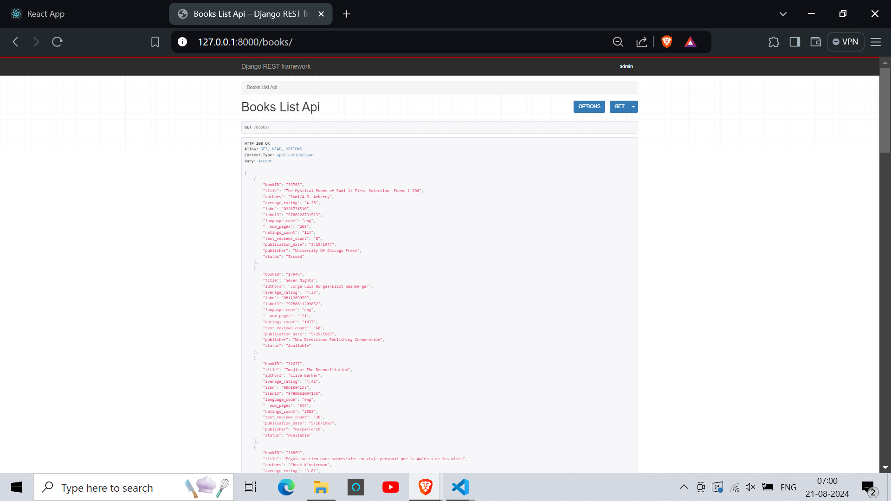
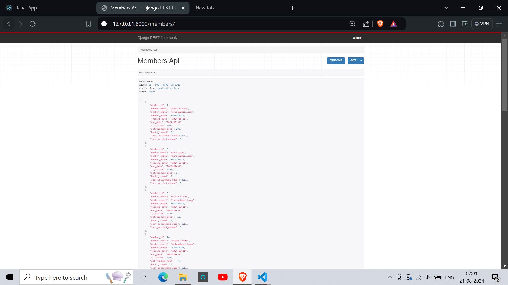
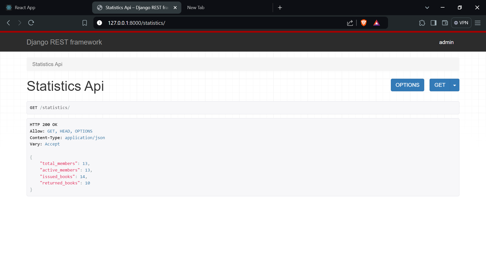

## **Library Management System Backend**

Backend system developed in Django REST Framework for Library Management Assignment.

## **Hosting**
The application has been hosted on Pythonanywhere and can be accessed at [https://cap26.pythonanywhere.com/](https://cap26.pythonanywhere.com/).

- To run locally, please clone the "local" branch of the repo. API Endpoints have been provided in the lower sections.

## ***Models Created***

I created the following models to facilitate the requirements:
- Members
- IssuedBooks
- BookStock

## **APIs Screenshots**

-   
-   
-   
-   

## ***APIs Created***

Following APIs were created for the front-end to interact with the models in various ways and for various React components:

## *1. BooksListAPI*

### *GET /books/*

Fetches a list of books from an external API and returns a fixed count of records. Determines if a book is 'Issued' or 'Available'.

#### **Parameters:**
- `count` (optional, default: 20): Number of records to return.
- `page` (optional, default: 1): Page number for pagination.
- `title` (optional): Filter books by title.
- `authors` (optional): Filter books by authors.

#### **Response:**
- `status: 200 OK`
- **Body:** A list of books, each with fields such as:
  - `bookID`
  - `title`
  - `authors`
  - `average_rating`
  - `status` (either "Issued" or "Available")

## *2. MembersAPI*

### *GET /members/*

Returns a list of member objects, optionally limited by the `count` parameter.

#### **Parameters:**
- `count` (optional): Number of member records to return.

#### **Response:**
- `status: 200 OK`
- **Body:** A list of members, each with fields such as:
  - `member_id`
  - `member_name`
  - `member_email`
  - `member_phone`
  - `joining_date`
  - `end_date`

### *POST /members/*

Creates a new member object.

#### **Request Body:**
- `member_name`: The name of the member.
- `member_email`: The email of the member.
- `member_phone`: The phone number of the member.
- `end_date`: The end date for the membership.

#### **Response:**
- `status: 201 Created` on success.
- **Body:** The created member object.
- `status: 400 Bad Request` on error.
- **Body:** Validation errors.

## *3. MembersPageAPI*

### *GET /members_page/*

Fetches members with pagination.

#### **Parameters:**
- `page` (optional, default: 1): Page number.
- `count` (optional, default: 20): Number of members per page.

#### **Response:**
- `status: 200 OK`
- **Body:** Contains pagination details and a list of members:
  - `total_pages`
  - `current_page`
  - `total_members`
  - `members`: List of member objects.

## *4. IssuedBooksListAPI*

### *GET /issued_books_list/*

Fetches a list of issued books, optionally limited by the `count` parameter.

#### **Parameters:**
- `count` (optional): Number of issued book records to return.

#### **Response:**
- `status: 200 OK`
- **Body:** A list of issued books, each with fields such as:
  - `book_id`
  - `issued_to_member`
  - `issue_date`
  - `return_date`
  - `fine`
  - `status`

## *5. IssuedBooksAPI*

### *GET /issued_books/*

Fetches details of a specific issued book by its `book_id`.

#### **Parameters:**
- `book_id`: The ID of the book.

#### **Response:**
- `status: 200 OK` on success.
- **Body:** The details of the issued book.
- `status: 404 Not Found` if the book is not issued.
- **Body:** Error message.

### *POST /issued_books/*

Creates a new issued book record.

#### **Request Body:**
- `book_id`: The ID of the book.
- `issued_to_member`: The member to whom the book is issued.
- `issue_date`: The date the book was issued.
- `return_date`: The expected return date.

#### **Response:**
- `status: 201 Created` on success.
- **Body:** The created issued book record.
- `status: 400 Bad Request` on error.
- **Body:** Validation errors.

### *PUT /issued_books/*

Updates the status of an issued book to 'Returned'.

#### **Request Body:**
- `book_id`: The ID of the book.

#### **Response:**
- `status: 200 OK` on success.
- **Body:** Success message.
- `status: 404 Not Found` if the book was not found or not issued.
- **Body:** Error message.

## *6. OverDueBookList*

### *GET /overdue_book_list/*

Fetches a list of overdue books and calculates the fines.

#### **Parameters:**
- `count` (optional, default: 20): Number of overdue book records to return.

#### **Response:**
- `status: 200 OK`
- **Body:** A list of overdue books, each with fields such as:
  - `member_id`
  - `member_name`
  - `book_id`
  - `book_title`
  - `book_author`
  - `overdue` (number of overdue days)
  - `fine`

## *7. SettleMemberDebtAPI*

### *GET /settle_member_debt/*

Settles the outstanding debt for a specific member.

#### **Parameters:**
- `member_id`: The ID of the member.

#### **Response:**
- `status: 200 OK` on success.
- **Body:** Success message.
- `status: 400 Bad Request` if the member is not found.
- **Body:** Error message.

## *8. StatisticsAPI*

### *GET /statistics/*

Fetches various statistics related to members and books.

#### **Response:**
- `status: 200 OK`
- **Body:** Statistics data including:
  - `total_members`
  - `active_members`
  - `issued_books`
  - `returned_books`
